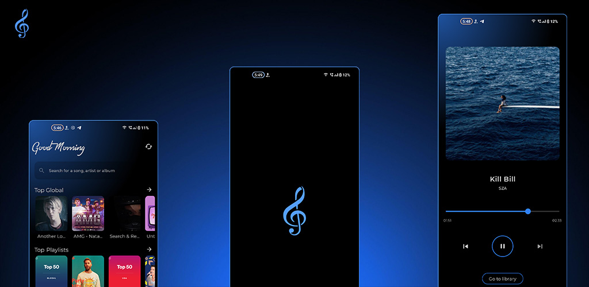
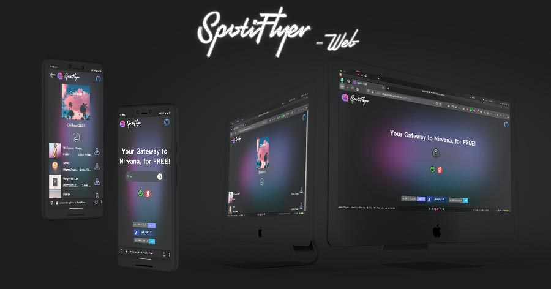
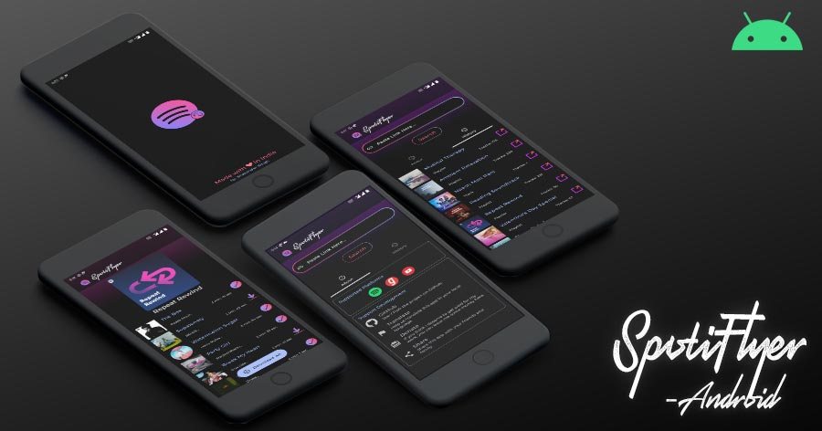
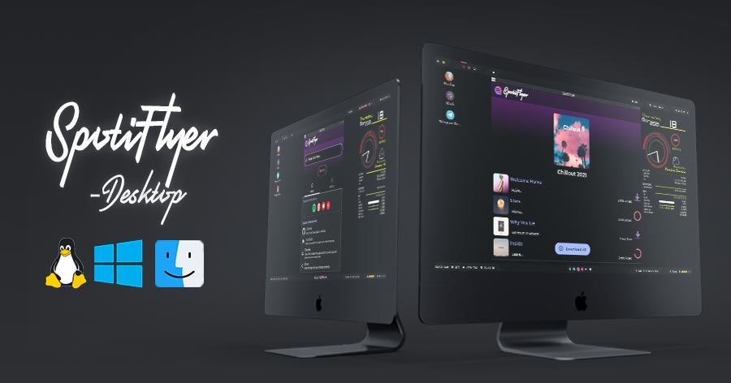

 We will from now on publish **[PLUGINS](https://gitlab.com/shabinder/soundbound#-disclaimer)** for **[Soundbound](https://soundbound.app)**, which users can install **explicitly** on their own responsibility [(*disclaimer*)](https://gitlab.com/shabinder/soundbound#-disclaimer).

 - [Soundbound Installation Guide.](https://soundbound.app/install)
   - [Wiki](https://soundbound.app/wiki)
   - [Telegram](https://soundbound.app/telegram)

# Soundbound - [Get Now!](https://soundbound.app/) 

---
> Please refer above for latest updates.
>  - Spotiflyer itself won't be getting any more updates, 
>  We all thank you for your support and hope to see you in [Soundbound Telegram Community](https://soundbound.app/telegram). 
---

# [SpotiFlyer](https://spotiflyer.in/)
- **Kotlin Multiplatform** Music Downloader ,supports **Spotify, Youtube, Gaana, Jio-Saavn and SoundCloud**.

Supports- Playlist, Albums, Tracks. _(If You know Any Source for Episodes/Podcasts create an Issue sharing It.)_

 **Currently running on:**
 - [Android (Jetpack Compose)](https://github.com/Shabinder/SpotiFlyer#-install) 
 - [Desktop (Compose for Desktop) β](https://github.com/Shabinder/SpotiFlyer#-install)
 - [Web (Kotlin/JS + React Wrapper) β](https://shabinder.github.io/SpotiFlyer/)
 - [_(WIP)_ IOS SOON (SWIFTUI)](https://github.com/Shabinder/spotiflyer-ios)

<!--

 -->

***Encourage this repo by giving it a Star⭐ .***

[SpotiFlyer](https://app.spotiflyer.in/) is an **App**(Written in **Kotlin**), which **aims** to work as:
  - **Downloads**: Albums, Tracks and Playlists,etc 
  - **Save your Data** ,by not **_Streaming_** your Fav Songs Online again & again(Just Download Them!)
  - **No ADS!** 
  - **Works straight out of the box** and does not require you to generate or mess with your API keys (already included).
  
### Supported Platforms:
- Spotify
- Gaana
- Youtube
- Youtube Music
- Jio-Saavn
- SoundCloud
- _(more coming soon)_

<!--START_SECTION:DCI 

<!--END_SECTION:DCI-->

        

## 💻 Install 

| Platform | Download | Status |
|----------|----------|--------|
| Android    || ✅ Stable | 
| Windows    || ✅ Stable | 
| Windows-JAR   || ✅ Stable | 
| MacOS-JAR    | | ✅ Stable |
| Linux-DEB    || ✅ Stable |
| Linux-JAR    || ✅ Stable | 
| Web    | | ⚠️ Beta | 

- To run the `jar` version, you need JAVA installed.
- MacOs DMG is not notarized and signed using a certificate , so Use jar in mac for now.

<!--  -->

### Want to Contribute 🙋‍♂️?
Want to contribute? Great!
All contributions are welcome, from code to documentation to graphics to design suggestions to bug reports. Please use GitHub to its fullest-- contribute Pull Requests, contribute tutorials or other wiki content-- whatever you have to offer, we can use it!

 - For **Translations** , read [Contributing.md](https://github.com/Shabinder/SpotiFlyer/blob/main/CONTRIBUTING.md)

**Please Donate to support me and my work!**
 

 

### Want to discuss? 💬
Have any questions, doubts or want to present your opinions, views? You're always welcome. You can [start discussions](https://github.com/Shabinder/SpotiFlyer/discussions).

### Todos 📄
 - Write **Tests**.
 - Support for Podcasts/Episodes and Shows.
 - Build a Media Player into this app. [#113](https://github.com/Shabinder/SpotiFlyer/issues/113) 
 
### Note
The availability of YouTube Music / JioSaavn in your country is important for this app to work. The reason behind this is, we use YouTube Music / JioSaavn to filter out our search results and get the desired song downloaded from Youtube Music OR other providers we may use(like Jio Saavn).
To check if YouTube Music is available in your country, visit [YouTube Music](https://music.youtube.com).

I am hosting a **server for WEB APP on my own personal device** , so expect some downtimes, If you have a **server** available and would like to share , open an issue or ping me wherever you can get a hold of me.

### Permissions Info:
 - **NETWORK**- *(INTERNET, ACCESS_NETWORK_STATE, ACCESS_WIFI_STATE)*: to access the online streaming services, and Confirm Network Connectivity.
 - **STORAGE**- *READ_STORAGE_PERMISSION, READ_EXTERNAL_STORAGE, WRITE_EXTERNAL_STORAGE, MANAGE_EXTERNAL_STORAGE)*: to save Downloaded Media Files.
 - **QUERY_ALL_PACKAGES**- in order to check if Youtube Music, Spotify, Gaana, JioSaavn, etc apps are installed and if they are, user can directly open them.
 - **REQUEST_IGNORE_BATTERY_OPTIMIZATIONS**: User Allows App to Run in Background at runtime in Permission Dialog.
 - **Wake Lock**: Don't let Wifi/Internet Sleep in screen off / dozing state when Songs are being downloaded.
 - **Foreground Service**: Service responsible to download and save songs to storage even after app is exited/background. 
 - **NOTE**: Analytics and Crashlytics are **OPT-IN** *(Disabled by Default)* and are **Self-Hosted**.

License

----
**GPL-3.0 License**
This program is free software: you can redistribute it and/or modify it under the terms of the GNU General Public License as published by the Free Software Foundation, either version 3 of the License, or (at your option) any later version.

***Free Software, Hell Yeah!***

Credits
----
 - Some Logos are Based on Logos by [Freepik](https://www.freepik.com/).
  
  
Disclaimer
----
Downloading copyright songs may be illegal in your country. This tool is for educational purposes only and was created only to show how Music Platform's Apis like Spotify's API can be exploited to download music. Please support the artists by buying their music.

