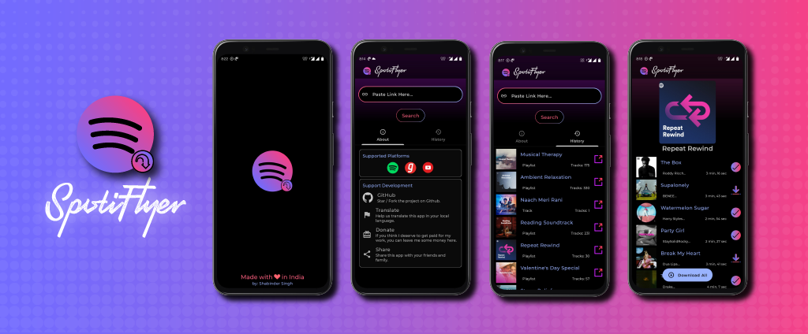

# SpotiFlyer
- **Spotify, Youtube, Gaana** Music Downloader For Android.

-Supports- Playlist, Albums, Tracks. _(If You know Any Source for Episodes/Podcasts create an Issue sharing It.)_

 

 

***Encourage this repo by giving it a Star⭐ .***

SpotiFlyer is an **Android App**(Written in **Kotlin**), which **aims** to work as:
  - **Downloads**: Albums, Tracks and Playlists,etc 
  - Extension To **mute** whenever a Spotify Ad Plays.(TODO)
  - **Save your Data** ,by not **_Streaming_** your Fav Songs Online again & again(Just Download Them!)
  - **No ADS!** 
  - **Works straight out of the box** and does not require you to generate or mess with your API keys (already included).
  
  
### Supported Platforms:
- Spotify
- Gaana
- Youtube
- _(more coming soon)_

### Downloads
The latest release and pre-release versions are available on GitHub.
Or to save a click, [this link](https://github.com/Shabinder/SpotiFlyer/releases/latest) should always point to the most recent release.

### App Highlights
 - **Jetpack Compose.**
 - **Modular Structure.**
 - **Hilt: Dependency Injection.**
 - **Dynamic UI: Gradients, etc.**
 - **Jetpack Libraries: DataStore, etc.**
 
### Want to Contribute 🙋‍♂️?
Want to contribute? Great!
All contributions are welcome, from code to documentation to graphics to design suggestions to bug reports. Please use GitHub to its fullest-- contribute Pull Requests, contribute tutorials or other wiki content-- whatever you have to offer, we can use it!

### Want to discuss? 💬
Have any questions, doubts or want to present your opinions, views? You're always welcome. You can [start discussions](https://github.com/Shabinder/SpotiFlyer/discussions).

### Todos 📄
 - Write **Tests**.
 - Support for Podcasts/Episodes and Shows.
 - Implementation To mute whenever Spotify Ad Plays.
 - Preference Screen.
 
### Note
The availability of YouTube Music in your country is important for this app to work since we use YouTube Music to filter out our search results.
To check if YouTube Music is available in your country, visit [YouTube Music](https://music.youtube.com).

License
----
**GPL-3.0 License**
This program is free software: you can redistribute it and/or modify it under the terms of the GNU General Public License as published by the Free Software Foundation, either version 3 of the License, or (at your option) any later version.

***Free Software, Hell Yeah!***

Credits
----
 - Cover Image Design by [Saksham](https://github.com/SakshamSingh-v2)
 - Some Logos are Based on Logos by [Freepik](https://www.freepik.com/).
  
  
Disclaimer
----
Downloading copyright songs may be illegal in your country. This tool is for educational purposes only and was created only to show how Music Platform's Apis like Spotify's API can be exploited to download music. Please support the artists by buying their music.
