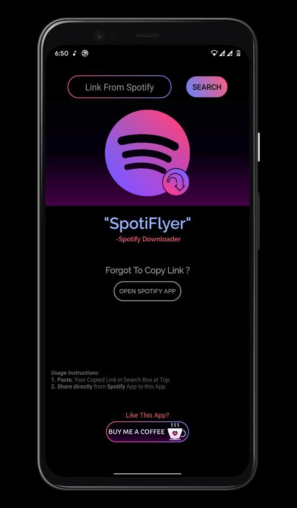
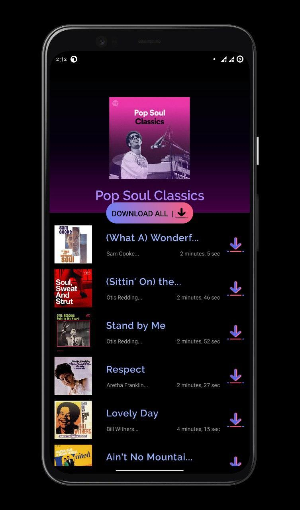

# SpotiFlyer
-Spotify Music Downloader For Android

## Screen-Shots:
<table style="width:100%">
  <tr>
    <th>Home Screen</th>
  </tr>
  <tr >
    <td></td>
  </tr>
  <tr>
 <th>PlayList Screen</th>
  </tr>
  <tr >
 <td></td>
  </tr>
</table>

SpotiFlyer is an **Android App**(Written in **Kotlin**), which **aims** to work as:
  - **Downloader** For Spotify:Albums, Tracks and Playlists.
  - Extension To **mute** whenever a Spotify Ad Plays.(TODO)
  - **Save your Data** ,by not listening your Fav Songs Online again & again.
  - **No ADS!** 
  - Works straight out of the box and does not require you to generate or mess with your API keys (already included).

Downloads
----
The latest release and pre-release versions are available on GitHub.
Or to save a click, [this link](https://github.com/Shabinder/SpotiFlyer/releases/latest) should always point to the most recent release.

### Development
Want to contribute? Great!
All contributions are welcome, from code to documentation to graphics to design suggestions to bug reports. Please use GitHub to its fullest-- contribute Pull Requests, contribute tutorials or other wiki content-- whatever you have to offer, we can use it!

### Todos
 - Write **Tests**.
 - Support for **Embedding Metadata in Mp3** like AlbumArt,Title,Singer,etc.
 - Support for Podcast/Episodes and Shows.
 - Animation while Downloading and Download Manager Listener
 - Implementation To mute whenever Spotify Ad Plays.

License
----
**GPL-3.0 License**
This program is free software: you can redistribute it and/or modify it under the terms of the GNU General Public License as published by the Free Software Foundation, either version 3 of the License, or (at your option) any later version.

***Free Software, Hell Yeah!***

Disclaimer
----
Downloading copyright songs may be illegal in your country. This tool is for educational purposes only and was created only to show how Spotify's API can be exploited to download music from YouTube. Please support the artists by buying their music.
